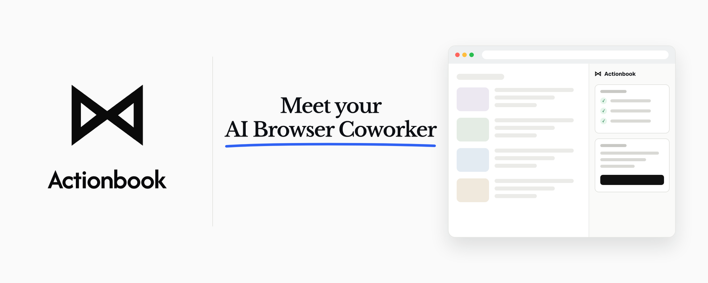
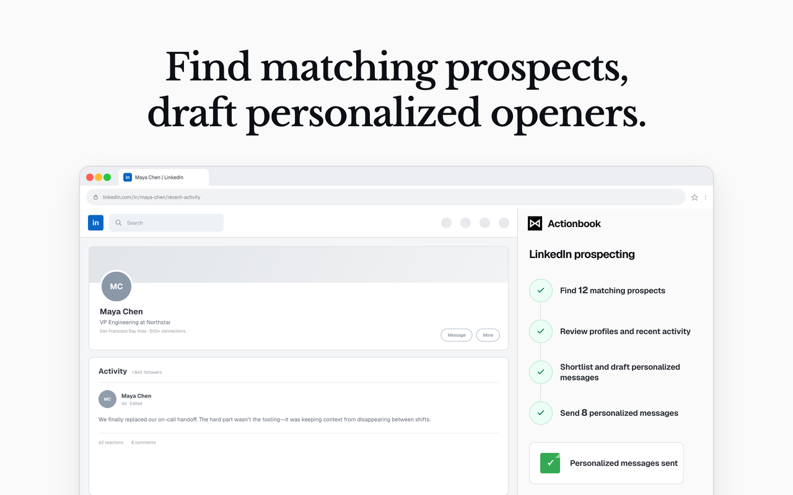
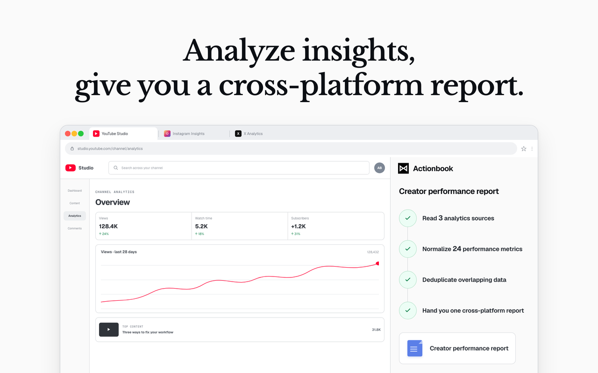
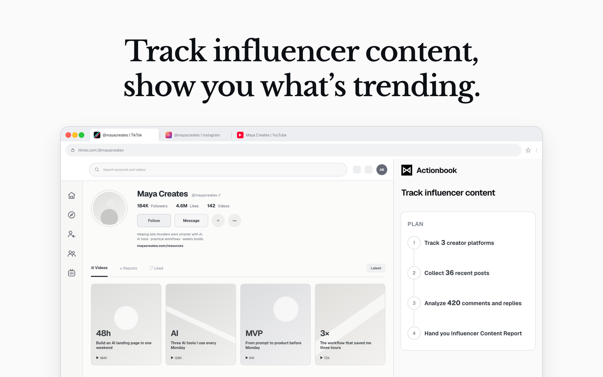
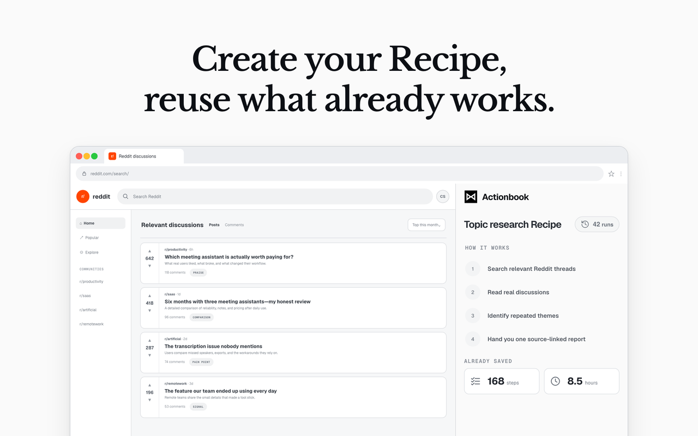

# Open Actionbook. Close out web work.

Actionbook is an AI agent in your browser. It reads data behind your logins, operates websites you already use, and delivers finished work, not answers.

[Website](https://actionbook.app) · [Discord](https://actionbook.app/discord) · [X](https://x.com/ActionbookHQ)

## What Actionbook can close out

Actionbook is built for marketers, sales teams, product managers, content creators, and solo founders who have too much web work on their plate. Use it for prospect research, dashboard reporting, creator analytics, and other multi-step web research. Get back a sourced report, a clean CSV, or ready-to-send drafts.

### Prospect research

Find people and companies that match your criteria, review their recent activity, and draft personalized openers based on the source material. Organize the results into a CSV with source links.

### Dashboard reporting

Collect selected analytics and campaign metrics from the dashboards you use, then prepare a clear report or CSV.

### Creator analytics

Review your account insights, identify what performed and what did not, and turn the findings into a focused report with next steps.

## Save it as a Recipe

When a task works the way you want, turn it into a **Recipe**. Next time, choose this Recipe, adjust the inputs, and run it again. A Recipe run finishes faster and uses far fewer tokens than working the task out from scratch.

## Works in your own browser

Actionbook runs in the browser you already use, not in a separate remote browser. That means it can work with dashboards, internal tools, and other pages you can open using your existing logins. Your credentials stay local.

## You stay in control

You start every task and remain part of the work. Follow along in the side panel, guide Actionbook when it needs context or a decision, confirm important actions, and pause or stop at any time.

## Getting started

1. [Install Actionbook](https://chromewebstore.google.com/detail/actionbook/bebchpafpemheedhcdabookaifcijmfo?utm_source=github&utm_medium=readme-getting-started) and sign in.
2. Open the page where you want to work.
3. Open Actionbook in the browser side panel and describe what you need it to complete.
4. Follow along, provide context when needed, and review the finished result.

## Stay tuned

We move fast. Star Actionbook on GitHub to support us and get the latest updates.

Join the community:

- [Chat with us on Discord](https://actionbook.app/discord) to get help, share your runs, and discuss ideas
- [Follow @ActionbookHQ on X](https://x.com/ActionbookHQ) for product updates and announcements

## Contributing

- **[Read the Contributing Guide](CONTRIBUTING.md)** for repository setup, package layout, and validation workflows.

## License

See [LICENSE](LICENSE) for the license details.
